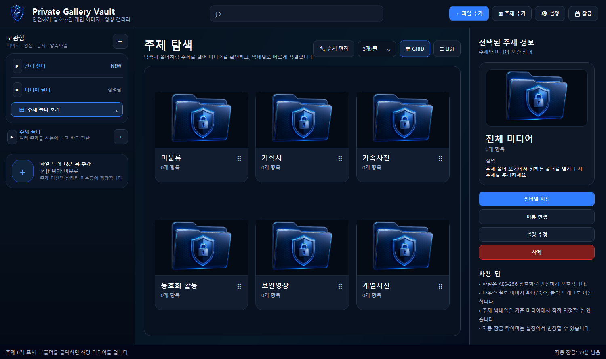
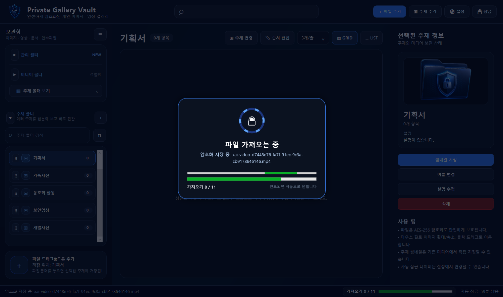
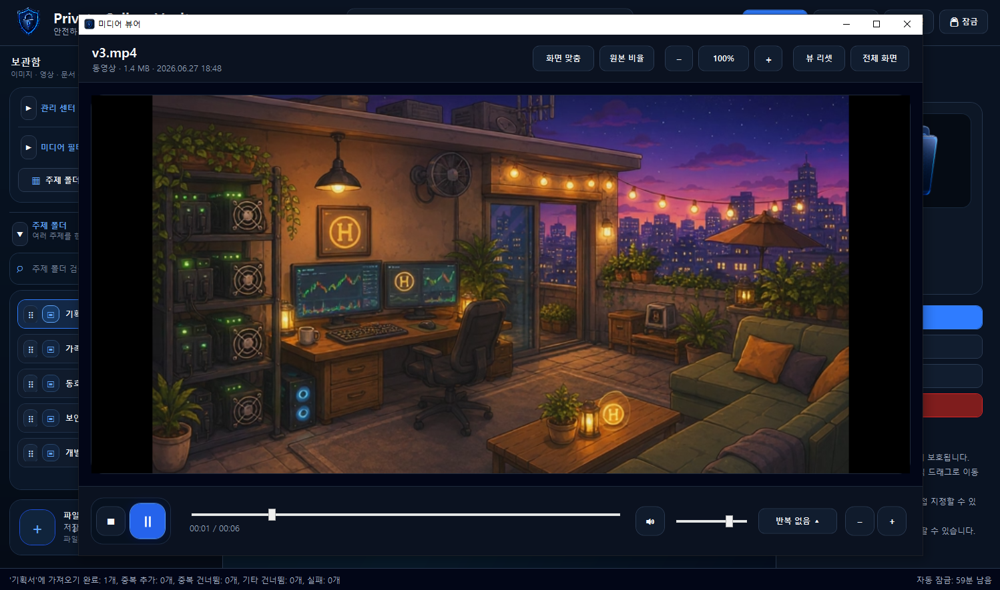
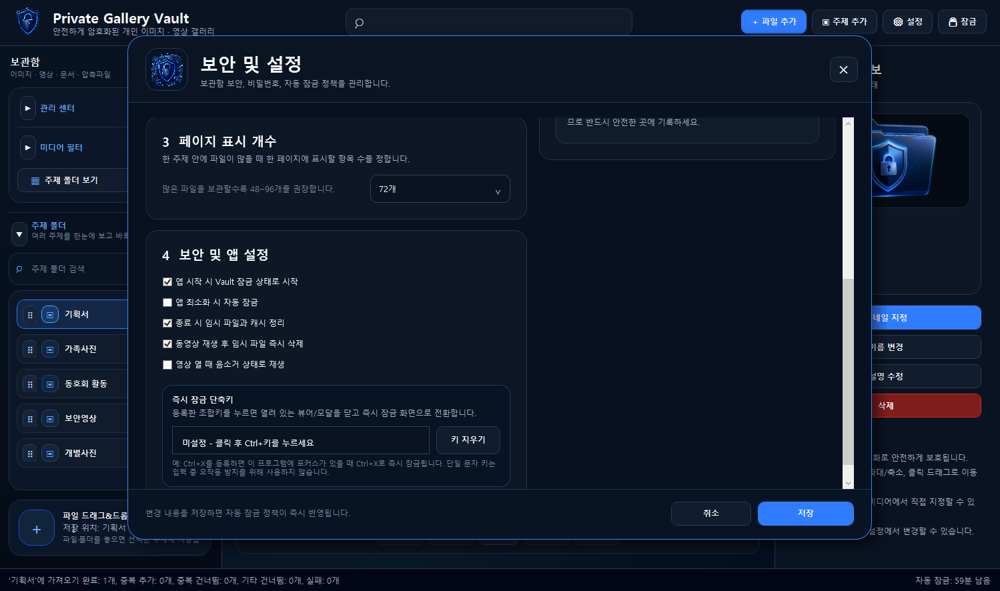

# Private Gallery Vault

Private Gallery Vault는 이미지, 영상, 문서, 압축 파일을 로컬 암호화 보관함에 정리하는 Windows 데스크톱 앱입니다. WPF와 .NET 기반으로 제작했으며, 주제 폴더, 미디어 미리보기, 중복 검사, 빠른 잠금, 백업 도구를 제공합니다.

파일은 보관함에 저장되기 전에 암호화됩니다. 보기나 외부 열기 과정에서 생성되는 임시 복호화 파일은 잠금 또는 종료 시 정리됩니다.

## 미리보기



## 스크린샷

### 메인 화면


### 파일 가져오기



### 이미지 뷰어


### 동영상 뷰어



### 설정



## 주요 기능

- 개인 미디어 파일을 위한 로컬 암호화 보관함
- 주제 폴더 기반 정리, 사이드바 검색, 정렬, 사용자 지정 순서
- 미디어/주제 그리드 보기와 리스트 보기
- 이미지 뷰어와 동영상 뷰어
- 드래그 앤 드롭 가져오기와 진행 상태 표시
- 파일 지문 기반 중복 감지
- 선택 파일 일괄 주제 변경
- 드래그 정렬과 위치 번호 입력 방식의 순서 이동
- 태그 관리, 최근 기록, 중복 관리, 백업/복원 도구
- `Ctrl+Shift+X` 같은 조합키 기반 즉시 잠금
- 특수문자나 비정상 유니코드가 섞인 파일명 가져오기 안정화

## 사용 기술

| 영역 | 기술 |
| --- | --- |
| UI | WPF, XAML |
| 런타임 | .NET 8 Windows |
| 언어 | C# |
| 로컬 DB | SQLite, Microsoft.Data.Sqlite |
| 암호화 | AES-GCM, PBKDF2 |
| 미디어 처리 | WPF Imaging, MediaElement, Windows Shell Thumbnail |
| 배포 | PowerShell release script, self-contained win-x64 publish |

## 빌드 방법

Windows PowerShell에서 저장소 루트로 이동한 뒤 실행합니다.

```powershell
.\build_release.ps1
```

빌드 결과는 아래 경로에 생성됩니다.

```text
publish\win-x64\
```

실행 파일:

```text
publish\win-x64\PrivateGalleryVault.exe
```

## 폴더 구조

```text
src/PrivateGalleryVault/
├─ Assets/       앱 아이콘과 UI 이미지 리소스
├─ Models/       데이터 모델
├─ Services/     보관함, 암호화, DB, 썸네일, 백업 서비스
├─ ViewModels/   화면 표시용 모델
├─ Views/        관리 센터 화면
└─ Windows/      메인 창과 대화상자
```

## 저장소 제외 항목

아래 파일은 저장소에 포함하지 않습니다.

- 실제 개인 이미지, 영상, 문서
- `*.db`, `*.sqlite` 같은 로컬 보관함 DB
- `settings.json`
- `*.pgvbackup`
- `bin/`, `obj/`, `publish/`

`.gitignore`에 기본 제외 규칙을 포함했습니다.
